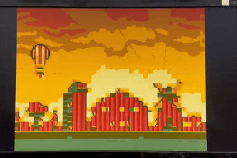
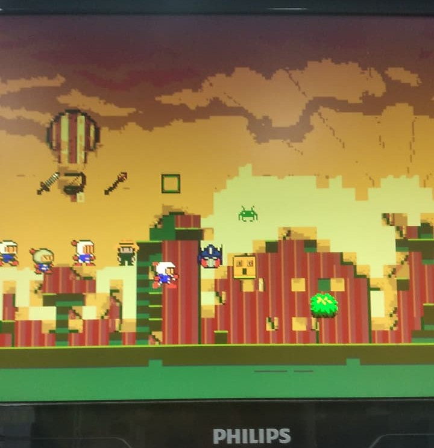

<h1 align="center"> 
 TEC499-Coprocessador-na-placa-DE1-SoC
</h1>

## Descrição do Projeto

  
Descrição

  O repositório é a primeira fase de um projeto do desenvolvimento de um jogo que irá funcionar na placa **De1-SoC**. Nessa fase foi desenvolvido um coprocessador gráfico em FPGA, feito na que será desenvolvido em verilog para suportar imagens, armazenar recursos gráficos e desenhar background, sprites e polígonos no VGA.

  O objetivo foi criar um processador gráfico para suportar a renderização visual de um protótipo do jogo Bomberman, que será desenvolvido em etapas futuras do projeto. O hardware foi desenvolvido em verilog para suportar imagens, armazenar recursos gráficos e desenhar background, sprites e polígonos no VGA
  Recursos utilizados:
  - Placa Terasic DE1-SoC Board
  - Quartus Prime 25.1std.0 Lite Edition
  - Verilog

  
<h2>Requisitos da 1º Etapa</h2>

  - O hardware deve ser desenvolvido em **verilog**;
  - Armazenar dados gráficos em memórias internas e gerar continuamente um sinal de vídeo **VGA**;
  - A resolução lógica da cena deverá ser de **320 × 240 pixels**, com duplicação de pixels na saída, fazendo o vídeo operar em 640 x 480 pixels;
  - A saída não poderá apresentar instabilidade visual, perda de sincronismo ou pixels indefinidos após a inicialização;
  - **Motor de Background** baseado em tilemap de 40x30 posições, com até 256 padrões;
  - **Motor de Sprites** que gerencia até 32 sprites simultâneos, com atributos individuais de posição (X, Y), índice de padrão, habilitação, prioridade e **espelhamento**;
  - **Rasterizador** que desenha de polígonos preenchidos;
  - Implementar pelo menos três **níveis de prioridade** entre as camadas;
  - Aplicar **transparência** antes da seleção do pixel final;
  - Converter o índice de cor de 8 bits por meio de uma paleta programável de 256 entradas RGB.

 ## Estrutura Implementada

Módulos do Sistema

A arquitetura do co-processador é modular, isolando o controle, via de dados (datapath), memórias e a saída VGA. A composição da cena ocorre através do paralelismo de motores dedicados.

### Registradores

Banco de Registradores e Controle

A interface principal de entrada do co-processador. Recebe comandos e instruçõess, armazenando as configurações de cena (coordenadas, cores, prioridades). Este módulo isola o barramento externo dos motores de renderização que operam no domínio de clock do pixel.

### Motores Gráficos

Motores de Renderização (Datapath)

O sistema renderiza os elementos gráficos por meio de três módulos principais:

- **Motor de Background:**
  Implementa uma camada de plano de fundo baseada em um *tilemap* de 40x30 entradas. Os padrões gráficos (*tiles*) possuem 8x8 pixels e ficam armazenados em memória RAM interna (com 256 padrões suportados). O motor realiza deslocamento (scroll) contínuo nos eixos X e Y para navegação pelo cenário.

  

  <figure>
    
    <figcaption>
      

        <b>Figura 1</b> - Movimentação do Background
      

    </figcaption>
  </figure>
  

- **Motor de Sprites:**
  Oferece suporte para renderizar até 32 sprites simultâneos. Cada sprite tem resolução de 16x16 pixels e é analisado em tempo real pelo motor. Para cada objeto, o motor respeita os seguintes atributos mapeados em memória: posição (X, Y), índice de padrão gráfico, bit de habilitação, nível de prioridade e controle de espelhamento (horizontal e vertical).

  

  <figure>
    
    <figcaption>
      

        <b>Figura 2</b> - 32 Sprites simultâneos no VGA
      

    </figcaption>
  </figure>
  

- **Rasterizador de Polígonos:**
  Permite o desenho de primitivas geométricas preenchidas utilizando aritmética inteira. É capaz de desenhar retângulos e triângulos, sendo útil para a criação de elementos de interface, obstáculos ou efeitos visuais na tela.

### Compositor e Driver VGA

Compositor de Cena e Controlador de Vídeo

- **Compositor:**
  Combina a contribuição individual de cada motor gráfico a cada ciclo de pixel. Possui lógica de mistura de camadas respeitando a prioridade de exibição, onde os sprites podem se sobrepor a polígonos, que por sua vez se sobrepõem ao background. A transparência é gerenciada reservando o índice `0` para que a camada inferior seja exibida.

- **Driver VGA e Paleta:**
  Controla os tempos estritos de H-SYNC e V-SYNC para a saída 640x480. Puxa os dados resultantes do compositor e utiliza uma paleta programável para traduzir o índice de cor (8 bits) em um valor final de RGB (256 cores), enviado diretamente ao DAC e monitor através dos pinos da FPGA.

## Mapa de Registradores

Endereçamento (Interface de Comandos)

O acesso de leitura/escrita aos elementos processados é realizado através da decodificação de um barramento de memória:

Endereço | Nome | Função
:---: | :--- | :---
`0x00` | STATUS | Acesso somente leitura às flags do hardware (Buffer pronto, Erro).
`0x01` | BG_SCROLL_X | Deslocamento horizontal do Background.
`0x02` | BG_SCROLL_Y | Deslocamento vertical do Background.
`0x03` | SPRITE_SEL | Seleciona o sprite (0 a 31) que terá seus atributos modificados.
`0x04` | SPRITE_X | Configura a coordenada X do sprite selecionado.
`0x05` | SPRITE_Y | Configura a coordenada Y do sprite selecionado.
`0x06` | SPRITE_FLAGS | Atributos combinados do sprite (Prioridade, Enable, Espelhamento).
`0x07` | SPRITE_PADRAO | Define qual padrão gráfico de 16x16 o sprite usará.
`0x08` | LAYER_ENABLE | Habilita independentemente as camadas (Background, Sprites, Polígonos).
`0x0B` | SWAP_CTRL | Sinaliza o request para a troca de buffers (Double Buffering).
`0x30` a `0x4F` | POLY_CONFIG | Atributos completos dos 4 slots de polígonos (Modo, Coordenadas dos Vértices e Cores).

## Barramentos

Barramentos

 
Barramento | Tamanho | Descrição
:---: | :--- |:---
Address | 16 | Barramento de endereçamento dos registradores internos
Data In | 9 | Barramento de entrada de dados para configuração
Control | 1 | Sinais de controle de escrita em memória
Status | 8 | Barramento de saída contendo as flags de estado do núcleo
VGA Out | 29 | Barramento de saída contendo os sinais físicos de vídeo

### Address
Esse barramento de 16 bits (endereco) é utilizado para selecionar em qual registrador do coprocessador a operação atual será realizada. Ele mapeia o acesso a configurações de sprites (endereços 0x03 a 0x07), propriedades dos polígonos (0x30 a 0x4F), controle de deslocamento do background (0x01 e 0x02) e requisições de sistema, como a troca de buffers (0x0B). Acessos a endereços fora do mapa documentado são ignorados e geram uma sinalização de erro.

### Data In
Barramento de entrada de dados de 9 bits. Ele é responsável por carregar os valores que serão salvos no registrador apontado pelo barramento de endereço. A largura de 9 bits foi escolhida por ela ser o tamanho exato necessário para representar a coordenada máxima do eixo X dentro da resolução lógica do sistema (320x240), cobrindo valores de 0 até 319.

### Control
Composto pelo sinal de controle que dá permição a interface de memória:

- Wr_en (Write Enable): Sinal de 1 bit que autoriza a gravação. O dado presente no barramento Data In só é gravado no registrador selecionado no Address quando esta flag está em nível lógico alto.

### Status
Barramento de saída de 8 bits (status) que reporta a saúde e o estado atual do coprocessador para o sistema de controle externo. Os bits menos significativos possuem funções específicas de monitoramento:

- Bit 1 (buffer_pronto): Indica a estabilidade do clock base (PLL locked), garantindo que o sistema está em frequência ideal de operação.
- Bit 0 (estimulo_invalido / endereco_invalido): Atua como uma flag de Erro. Fica em nível lógico alto caso o controlador tente acessar um registrador fora do mapa existente ou caso o cenário injetado seja inválido.

### VGA Out
Este é o barramento de saída física do coprocessador.

- Cores (24 bits): Barramentos VGA_R, VGA_G e VGA_B, com 8 bits cada, carregando o valor da cor do pixel extraído da paleta.
- Sincronismo (5 bits): Sincronismo horizontal (VGA_HS), vertical (VGA_VS), pulso de relógio para o DAC (VGA_CLK) e controles de período ativo (VGA_BLANK_N e VGA_SYNC_N).

## Testes

Testes

 Para interagir com o coprocessador gráfico e realizar testes foram adicionados estados que simulam cenários de atuação do hardware e foram utilizados entradas da placa.
 ### Entradas

Interface de demonstração

 
- Key 0: Confirmar ação;
- Key 1: Espelhamento horizontal e vertical;
- Key 2: Mudar sprite/polígono selecionado;
- Key 3: Reset global;
- Sw 0-2: **Estados** de seleção dos elementos gráficos;
- Sw 3-4: Muda cor do polígono;
  - 00: vermelho
  - 01: verde
  - 10: azul
  - 11: amarelo
- Sw 5: Velocidade de movimento (1 é rápido);
- Sw 6-9: Movimentação de elementos.
  - Sw 6: Cima
  - Sw 7: Baixo
  - Sw 8: Direita
  - Sw 9: Esquerda
 

Cenários:

- 000: Seleção do background;
- 001: Seleção do Sprite;
- 010: Permite o sprite se mover;
- 011: Seleciona polígono;
- 100: Buffer;
- 101,110,111: Estímulo inválido.

### Movimentação de Background

 
Cenário 000

Entradas:

- SW[2:0] = 000
- KEY0
- SW[5]
- SW[9:8] e SW[7:6]

Procedimento:

1. Configurar SW[2:0] em 000.
2. Pressionar KEY0 para ativar/desativar a movimentação contínua do background.
3. Controlar o deslocamento horizontal com SW[9:8]:
  - 00 ou 11 → imóvel
  - demais combinações → esquerda / direita
4. Controlar o deslocamento vertical com SW[7:6]:
  - 00 ou 11 → imóvel
  - demais combinações → cima / baixo
5. Utilizar SW[5] para alterar a velocidade do scroll.
  - 1 → rápido
  - 2 → normal

Saída:

- Movimentação do plano de fundo (tilemap) nas direções horizontal e vertical.
- Velocidade de deslocamento alterável via SW[5].
- Parada do movimento quando as chaves de direção estão em 00 ou 11.

### Seleção, Confirmação e Espelhamento de Sprites

 
Cenário 001

 **Entradas:**

- SW[2:0] = 001
- SW[5] (0 = Horizontal / 1 = Vertical)
- KEY2
- KEY0
- KEY1

**Procedimento:**

1. Configurar SW[2:0] em 001.
2. Pressionar KEY2 repetidamente para alternar entre as sprites disponíveis.
3. Após escolher a sprite desejada, pressionar KEY0 para confirmá-la.
4. Pressionar KEY1 para aplicar o espelhamento da sprite confirmada, de acordo com o valor de SW[5]:
  - SW[5] = 0 → espelhamento horizontal
  - SW[5] = 1 → espelhamento vertical

**Saída:**

- Alternância visual entre as diferentes sprites disponíveis.
- Confirmação e exibição da sprite selecionada na tela.
- Espelhamento horizontal ou vertical da sprite confirmada conforme SW[5].

### Movimentação de Sprite

 
Cenário 010

 **Entradas:**

- SW[2:0] = 010
- SW[9:8] (esquerda / direita)
- SW[7:6] (cima / baixo)
- SW[5] (velocidade)

**Procedimento:**

1. Configurar SW[2:0] em 010.
2. Utilizar as chaves de movimento da mesma do cenário de background:
  - SW[9:8] → movimento horizontal (imóvel em 00 ou 11)
  - SW[7:6] → movimento vertical (imóvel em 00 ou 11)
3. Ajustar a velocidade com SW[5].
**Observação:**

- O movimento altera a última sprite confirmada no cenário 001.

**Saída:**

- Movimentação da sprite selecionada nas quatro direções.
- Controle de velocidade via SW[5].
- Parada do movimento quando as chaves de direção estão em 00 ou 11.

### Criação de Polígonos

 
Cenário 011

 **Entradas:**
- SW[2:0] = 011
- KEY2
- KEY0
- SW[9:6] (posição)
- SW[4:3] (cor)

**Procedimento:**
1. Configurar SW[2:0] em 011.
2. Pressionar KEY2 para alternar entre as possibilidades de polígonos disponíveis (retângulos e triângulos).
3. Ajustar a posição do polígono com SW[9:6].
4. Escolher a cor com SW[4:3].
5. Pressionar KEY0 para confirmar e desenhar o polígono na tela.

**Saída:**
- Exibição de polígonos preenchidos (retângulos e/ou triângulos) na tela.
- Posição e cor configuráveis pelas chaves.
- Confirmação e rasterização correta após o acionamento de KEY0.

### Transparência e Prioridade

 
Cenário 001

**Entradas:**
- SW[2:0] = 001 (modo de seleção de sprite)
- KEY2, KEY0
- SW[9:6] e SW[4:3] (para o polígono)
- Criação de um polígono qualquer

**Procedimento:**
1. Entrar no cenário de sprites (SW[2:0] = 001).
2. Pressionar KEY2 até selecionar o **sprite 4**.
3. Pressionar KEY0 para confirmar a sprite.
4. Criar um polígono qualquer na tela (utilizando o cenário de polígonos).
5. Observar a sobreposição entre o sprite, o polígono e o background.

**Saída:**
- Demonstração de **transparência** (índice de cor 0).
- **Prioridade** entre as camadas (Sprite > Polígono > Background).

### Troca de Background (Buffer)

 
Cenário 100

 **Entradas:**
- SW[2:0] = 100
- KEY0

**Procedimento:**
1. Configurar SW[2:0] em 100.
2. Pressionar KEY0 para ativar a troca de buffer e realizar a troca do background.

**Saída esperada:**
- Troca do plano de fundo exibido na tela.
- Acionamento do **LED1** indicando a ativação do buffer.

### Testbenches

 
 
Testes e Script de automação

 

