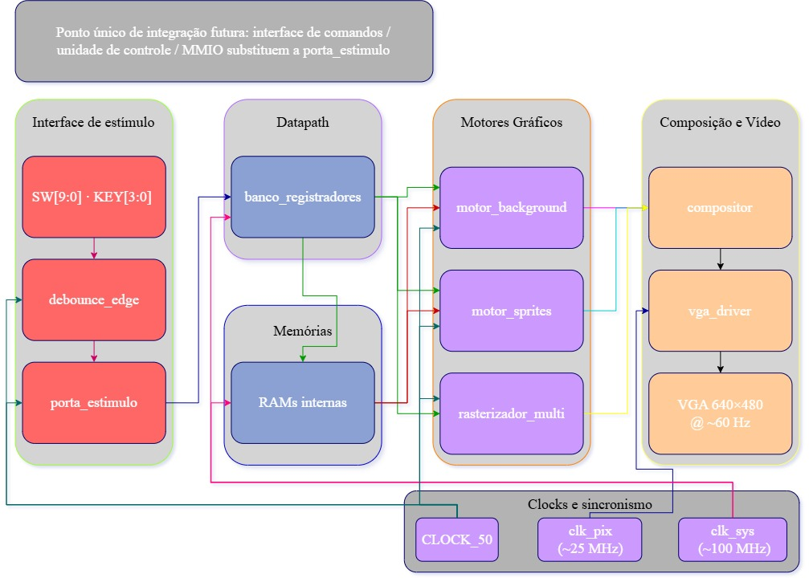
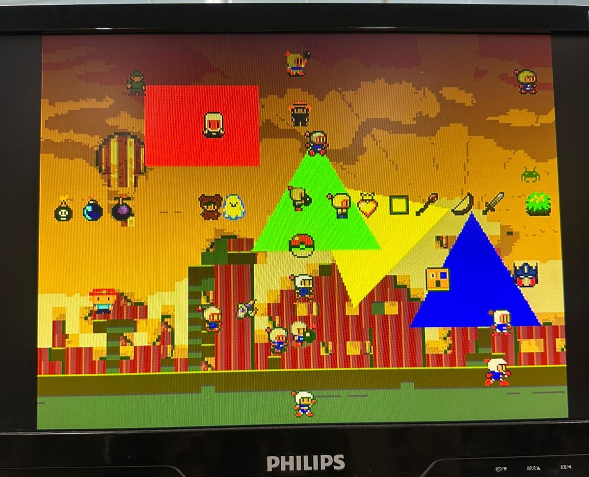
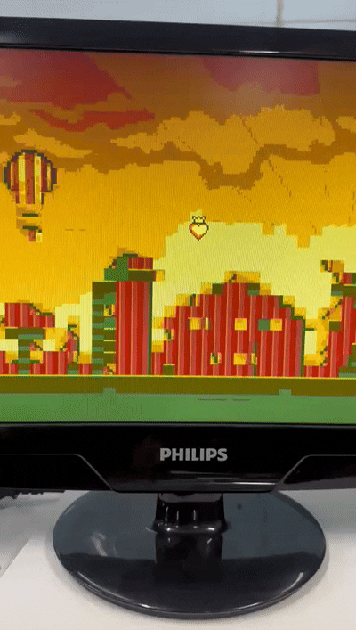
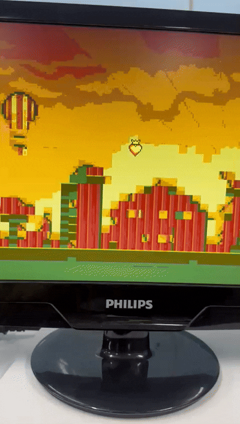

<h1 align="center"> 
 TEC499-Coprocessador-na-placa-DE1-SoC
</h1>

## Descrição do Projeto

  
Descrição

  O repositório é um dos componentes da primeira fase de um projeto do desenvolvimento de um jogo que irá funcionar na placa **De1-SoC**. Nessa fase foi desenvolvido um núcleo de um coprocessador gráfico em FPGA, este foi feito em verilog comportamental e tem capacidade para suportar imagens, armazenar recursos gráficos e desenhar background, sprites e polígonos no VGA.

  O objetivo final deste projeto é criar um coprocessador gráfico completo para suportar a renderização visual de um protótipo do jogo Bomberman, que será desenvolvido em etapas futuras.
  
  Recursos utilizados nesta primeira fase:
  - Placa Terasic DE1-SoC Board com FPGA Cyclone V 5CSEMA5F31C6
  - Quartus Prime 25.1std.0 Lite Edition
  - Verilog (comportamental)

  
<h2>Requisitos da 1º Etapa</h2>

  - O hardware deve ser desenvolvido em **verilog**;
  - Armazenar dados gráficos em memórias internas e gerar continuamente um sinal de vídeo **VGA**;
  - A resolução lógica da cena deverá ser de **320 × 240 pixels**, com duplicação de pixels na saída, fazendo o vídeo operar em 640 x 480 pixels;
  - A saída não poderá apresentar instabilidade visual, perda de sincronismo ou pixels indefinidos após a inicialização;
  - **Motor de Background** baseado em tilemap de 40x30 posições, com até 256 padrões;
  - **Motor de Sprites** que gerencia até 32 sprites simultâneos, com atributos individuais de posição (X, Y), índice de padrão, habilitação, prioridade e **espelhamento**;
  - **Rasterizador** que desenha de polígonos preenchidos;
  - Implementar pelo menos três **níveis de prioridade** entre as camadas;
  - Aplicar **transparência** antes da seleção do pixel final;
  - Converter o índice de cor de 8 bits por meio de uma paleta programável de 256 entradas RGB.

<h2>Requisitos funcionais e Não funcionais</h2>

 
### Interface de vídeo e resolução

A saída VGA está com 640 × 480 pixels, com
resolução lógica de 320 × 240 pixels e duplicação espacial 2×2 de cada pixel lógico. O módulo vga_driver gera sincronismo horizontal e vertical
compatível com 640 × 480, alimentado por um PLL que produz o clock de pixel
de 25 MHz. A coordenada lógica é obtida por divisão inteira por 2 das coordenadas de
varredura, e o compositor opera exclusivamente no domínio lógico.

### Motor de background (tilemap)

O requisito mínimo pede ao menos uma camada de background com tilemap de 40 × 30
entradas, tiles de 8 × 8 pixels, pelo menos 256 padrões disponíveis, atualização de tiles
por posição, deslocamento horizontal e vertical com tratamento de repetição ou recorte, e
geração de índice de cor válido sem interromper o fluxo de vídeo. A implementação foi capaz de cumprir esses requisitos.

### Motor de sprites

É exigido memória de atributos para no mínimo 32 sprites, sprites de 16 × 16
pixels (formados por quatro tiles 8 × 8), com posição X/Y, índice de padrão, habilitação,
prioridade, espelhamento horizontal e vertical, e seleção de paleta. Também exige
documentação da prioridade entre sprites no mesmo pixel. Levando em consideração todos esses pontos, o motor de sprites foi concluído com sucesso.

### Rasterizador de polígonos

O desenho de triângulos e retângulos preenchidos com aritmética inteira são obrigatórios para o funcionamento do rasterizador. Ambos objetivos estão presentes no projeto.

### “Compositor” (MUX de prioridade), paleta e transparência

O compositor combina, a cada pixel lógico, as contribuições do background, da camada
de polígonos e dos sprites. A transparência (índice 0) é aplicada antes da
seleção do pixel final.
A conversão do índice de 8 bits para RGB é realizada por uma paleta de 256 entradas
interna ao driver VGA, produzindo o sinal de 8 bits por canal enviado ao DAC VGA da
DE1-SoC.

### Interface de comandos e mapa de registradores

Embora a integração MMIO completa com o processador ARM não faça parte deste
problema, o núcleo já possui um mapa de registradores documentado
(banco_registradores) com endereços para scroll, seleção e atributos de sprites, flags de
camada, controle de troca de buffer e parâmetros de polígonos. A porta de estímulo
(porta_estimulo) emula a escrita nesses registradores a partir de chaves e botões,
permitindo demonstrar todos os cenários de teste exigidos (transparência, espelhamento,
sobreposição, prioridade, troca de buffers e comandos inválidos). Endereços fora do
mapa geram sinalização de estimulo/endereço inválido, atendendo ao cenário de
comandos inválidos.

### Conclusão

De forma geral, o núcleo atende aos requisitos funcionais centrais do motor gráfico
(background com scroll e wrapping, 32 sprites com flip e prioridade, retângulos e
triângulos, composição com transparência e três níveis de prioridade, paleta de 256 cores,
VGA 640×480 com resolução lógica 320×240). Os principais pontos que serão reestruturados são:
- Escrita dinâmica completa de tilemap e padrões ainda não exposta na
demonstração (estrutura de memória preparada);
- Paleta única compartilhada, sem seleção independente de sub-paleta por sprite;

<h2>Estrutura proposta e decisões tomadas</h2>

### Visão geral da arquitetura

O top-level (coprocessador.v) instancia PLLs, debouncers, a porta de estímulo, o banco
de registradores, as memórias de tilemap e de padrões, os três motores (background,
sprites e polígonos), o compositor e o driver VGA. A demonstração na DE1-SoC utiliza
chaves e botões para programar registradores e exercitar os cenários de teste exigidos.

### Domínios de clock e sincronização

Foram adotados dois PLLs a partir do CLOCK_50 da placa:
- meu_pll: gera o clock de pixel de 25 MHz (clk_pix) necessário para 640 × 480 a 60
Hz.
- pllpara100: gera um clock de 100 MHz (clk_pll_100) utilizado pelas memórias de
padrões e tilemaps, permitindo leituras com margem de tempo no pipeline gráfico.

O reset global combina o botão KEY[3] com os sinais de locked dos PLLs, garantindo que
a lógica de vídeo só opere com clocks estáveis. A troca de buffer de tilemap é
sincronizada com a borda de subida do VSYNC no domínio do pixel clock, evitando
artefatos de tearing. Sinais de controle gerados no domínio de 50 MHz (porta de estímulo
e banco de registradores) são consumidos pelos motores no domínio de pixel; quando
necessário, sincronizadores de dois estágios são empregados.

### Interface de comandos e banco de registradores

Em vez de uma interface MMIO completa (reservada a etapas posteriores), o projeto
implementa um banco de registradores com mapa de endereços explícito e uma porta de
estímulo que emula escritas a partir da interface física da placa. Essa decisão atende
simultaneamente a dois objetivos do enunciado:
- permitir demonstração completa do núcleo sem o processador ARM;
- manter o mapa de registradores genérico e documentado para futura integração.

O mapa inclui registradores de status, scroll do background, seleção e atributos de até 32
sprites, flags de habilitação de camadas, controle de sobreposição e prioridade entre
sprites, pulso de troca de buffer e parâmetros de até quatro polígonos (vértices, cor, modo
retângulo/triângulo e habilitação). Escritas em endereços inválidos são sinalizadas,
permitindo o cenário de teste de comandos inválidos.

### Memórias internas

As memórias foram implementadas como blocos RAM dual-port gerados pelo Quartus (IP
altsyncram), inicializados por arquivos MIF:
- Duas RAMs de tilemap (A e B) de 2048 × 8 bits, permitindo double-buffering da
cena de fundo;
- RAM de padrões de tiles com 16384 × 8 bits (capacidade para 256 tiles de 8 × 8);
- RAM de padrões de sprites com capacidade compatível com blocos de 16 × 16;
- Paleta de 256 entradas RGB.

A decisão de manter duas cópias do tilemap e de sincronizar a troca com VSYNC foi
tomada para permitir atualização de cena sem interrupção visual, alinhada ao requisito de
estabilidade da saída e ao cenário de teste de troca de buffers.

### Motor de background

O motor de background opera no domínio do clock de pixel com um pipeline de três estágios:
- cálculo de coordenadas com scroll e wrapping, derivação de coluna/linha de tile e offset interno do tile;
- leitura do índice de tile no tilemap e formação do endereço de padrão;
- leitura do índice de cor e validação alinhada ao pipeline.

O wrapping é realizado por subtrações condicionais de 320 e 240, evitando divisores e mantendo a
lógica simples e inteira. Essa abordagem garante que, para cada pixel lógico válido, um índice de cor esteja
disponível no momento correto, sem bolhas que interrompam o fluxo de vídeo.

### Motor de sprites

O motor de sprites verifica, para a coordenada lógica atual, quais dos 32 sprites estão
habilitados e cobrem aquele pixel, aplicando espelhamento horizontal e vertical conforme
as flags. A prioridade entre sprites que ocupam o mesmo pixel é resolvida por um campo
de prioridade de 3 bits e, nos cenários de demonstração, por registradores de
sobreposição dedicados que permitem forçar a ordem entre dois sprites específicos. O
índice de cor 0 é tratado como transparente.
Sprites de 16 × 16 são formados a partir de padrões armazenados em memória, coerente
com a ideia de compor a imagem a partir de quatro tiles 8 × 8. A escolha de limitar a
demonstração a 32 sprites e a um conjunto finito de padrões equilibra o requisito mínimo
do enunciado com o uso de recursos de memória da FPGA.

### Rasterizador de polígonos

O rasterizador_multi avalia até quatro polígonos por pixel. No modo retângulo, utiliza
comparações de limites; no modo triângulo, utiliza o teste clássico de orientação (produtos
cruzados com aritmética inteira signed) para decidir se o ponto está no interior. O primeiro
polígono que contém o pixel (na ordem de índice) determina a cor. Essa decisão privilegia
simplicidade e previsibilidade em hardware, em detrimento de uma fila de prioridade mais
elaborada entre polígonos.

A limitação a quatro polígonos simultâneos é suficiente para demonstrar retângulos e
triângulos preenchidos e para compor elementos de interface, atendendo ao requisito
mínimo sem consumir excesso de lógica combinacional no caminho crítico do pixel.

### Compositor e regra de prioridade

O compositor implementa uma prioridade fixa e documentada entre camadas: sprite >
polígono > background, com aplicação de transparência (cor ≠ 0) antes da seleção. Essa
regra fornece os três níveis de prioridade exigidos e é facilmente compreensível na
demonstração. Alternativas mais flexíveis (por exemplo, prioridade programável por
camada) foram consideradas, mas rejeitadas nesta versão para reduzir complexidade de
controle e de verificação.

### Saída VGA

O módulo vga_driver gera os sinais HSYNC, VSYNC, blank e o clock de pixel, além de
produzir as coordenadas de varredura. A resolução lógica 320 × 240 é obtida por divisão
por 2, e o pixel lógico é replicado espacialmente na saída 640 × 480. A conversão de
índice para RGB é feita pela paleta antes dos pinos VGA_R/G/B.

### Estratégia de demonstração e testes

A porta de estímulo implementa máquinas de sequência que, a partir das chaves e
botões, programam os registradores para exercitar transparência, espelhamento,
sobreposição, prioridade, troca de buffers e comandos inválidos. Displays de 7 segmentos
e LEDs fornecem feedback do cenário ativo e de condições de erro. Essa abordagem
permite validação em hardware sem depender ainda do driver Linux.

### Justificativa das principais decisões

As decisões centrais foram orientadas por três critérios:
- atender aos requisitos mínimos de funcionalidade gráfica com arquitetura modular;
- manter a saída de vídeo estável e contínua;
- preparar o mapa de registradores e as memórias para integração futura via MMIO, sem acoplar o núcleo a um jogo específico.

O uso de estímulo local, double-buffer de tilemap sincronizado a VSYNC, pipelines curtos nos
motores e prioridade fixa de camadas reflete o equilíbrio entre completude funcional,
clareza de demonstração e contenção de recursos na Cyclone V.

 
<h2>Análise de Recursos</h2>

 Esta seção consolida os resultados de síntese e análise de timing obtidos com o Quartus Prime para o dispositivo Cyclone V 5CSEMA5F31C6 (DE1-SoC), confrontando-os com os requisitos de desempenho implícitos do PBL01: geração estável de VGA 640 × 480 a ~60 Hz (clock de pixel de 25 MHz), operação das memórias e do datapath gráfico sem interrupção do fluxo de vídeo, e utilização de recursos compatível com a FPGA da placa.

### Utilização de recursos

O relatório de fitter do projeto indica a seguinte ocupação aproximada:
- Lógica: cerca de 2.564 ALMs de 32.070 disponíveis (aproximadamente 8 %);
- Registradores: cerca de 1.616 registradores dedicados;
- Memória em bloco: cerca de 229.376 bits de 4.065.280 disponíveis (cerca de 6 %),
implementados em 28 blocos M10K de 397 disponíveis (cerca de 7 %);
- Blocos DSP: 24 de 87 disponíveis (cerca de 28 %), utilizados principalmente nas
operações aritméticas do rasterizador de triângulos e em caminhos de endereço;
- PLLs: 2 de 6 disponíveis (33 %), correspondentes ao clock de pixel e ao clock de
100 MHz das memórias;
- Pinos: 241 de 457 (53 %), coerente com o uso de VGA, chaves, botões, LEDs e
displays;

A utilização de lógica e de memória é confortável, deixando margem significativa para
expansões futuras (mais sprites, segunda camada de background, interface MMIO
completa ou lógica de aceleração adicional). O consumo de DSP é o item relativamente
mais elevado, o que é esperado dada a natureza combinacional do teste de inclusão em
triângulos.

### Timing e frequências

Os domínios de clock relevantes são: CLOCK_50 (base), clk_pix (25 MHz alvo) e
clk_pll_100 (100 MHz alvo). O relatório de timing estático (STA) apresenta, no modelo
Slow 1100 mV 85 °C, Fmax reportado na ordem de 140 MHz para o domínio de 100 MHz
e valores muito inferiores (na faixa de poucos MHz) para o domínio associado ao clock de
pixel em algumas seções do relatório.

O domínio de 100 MHz das memórias apresenta Fmax reportado acima de 140 MHz no
modelo lento, o que é adequado para as leituras de tilemap e padrões alinhadas ao
pipeline gráfico.

### Desempenho funcional

Do ponto de vista funcional, o núcleo gera continuamente o quadro VGA, aplica scroll com
wrapping, compõe até 32 sprites com transparência e espelhamento, rasteriza até quatro
polígonos e realiza a troca de buffer de tilemap na borda de VSYNC. A resolução lógica
320 × 240 com duplicação 2×2 atende ao requisito de saída 640 × 480. A latência do
pipeline de background (três ciclos de pixel) é absorvida pelo alinhamento de validação de
cor, de modo que não há bolhas visíveis na imagem.

A prioridade fixa de camadas e a resolução de prioridade entre sprites permitem
demonstrar todos os cenários de teste listados no enunciado (transparência,
espelhamento, sobreposição, prioridade, troca de buffers e comandos inválidos), desde
que exercitados pela porta de estímulo.

### Gargalos identificados

Os principais gargalos observados na arquitetura atual são:
- Caminho combinacional do rasterizador de triângulos e da avaliação simultânea de
múltiplos sprites no mesmo ciclo de pixel, que pressiona o timing do domínio de 25
MHz;
- Ausência de escrita runtime completa nas memórias de tilemap e de padrões a
partir da porta de estímulo (wren fixo em 0 na versão de demonstração), limitando
a atualização dinâmica de conteúdo gráfico sem reprogramação da FPGA;
- Paleta única compartilhada, sem sub-paletas por sprite, o que reduz flexibilidade de
colorização independente de objetos;
- Dependência de estímulo local (chaves/botões) em vez de uma interface MMIO
real, o que é aceitável no Problema I, mas impede ainda a validação ponta a ponta
com software no ARM.

### Limitações conhecidas

Em relação ao enunciado completo do PBL01, temos listadas as seguintes limitações:
- A atualização dinâmica de cada posição do tilemap e a carga de novos padrões em
runtime não estão demonstradas pela interface atual (pois memórias estão sendo
inicializadas com arquivos .MIF), embora a estrutura de memória dual-port esteja
preparada;
- Seleção de paleta por sprite não está implementada de forma independente;
- O número de polígonos simultâneos está limitado a quatro;

Essas limitações não impedem a demonstração do núcleo na placa nem o atendimento ao
núcleo dos requisitos gráficos mínimos.

### Melhorias possíveis

Com base na análise de recursos e timing, as melhorias mais promissoras são:
- Expor portas de escrita nas RAMs de tilemap e de padrões, integradas ao mapa de
registradores, permitindo carga dinâmica de cena;
- Implementar sub-paletas ou offset de índice de cor por sprite, aproximando o
comportamento de consoles de 16 bits clássicos;
- Substituir a porta de estímulo por um interface MMIO mapeado no barramento do
HPS (Cyclone V SoC), preparando o caminho para o driver Assembly e a aplicação
C;
- Avaliar uma segunda camada de background ou mais sprites, dado que a utilização
atual de ALMs e memória deixa margem confortável;

### Conclusão da análise

O coprocessador gráfico apresentado utiliza uma fração modesta dos recursos da
Cyclone V da DE1-SoC e implementa, em hardware, os elementos centrais exigidos pelo
PBL01: background em tiles com scroll, sprites com atributos completos, rasterização de
retângulos e triângulos, composição com transparência e prioridade, e saída VGA estável
em 640 × 480 a partir de resolução lógica 320 × 240. Os pontos de atenção concentram-
se na consolidação do timing do domínio de pixel, na exposição de escritas dinâmicas de
memória e na evolução da interface de controle em direção ao MMIO.

 ## Estrutura Implementada

Módulos do Sistema

A arquitetura do co-processador é modular, isolando o controle, via de dados (datapath), memórias e a saída VGA. A composição da cena ocorre através do paralelismo de motores dedicados.

 <figure>
  
  <figcaption>
    

     <b>Figura 1</b> - Diagrama do Coprocessador Gráfico
    

  </figcaption>
 </figure>

### Registradores

Banco de Registradores e Controle

A interface principal de entrada do co-processador. Recebe comandos e instruçõess, armazenando as configurações de cena (coordenadas, cores, prioridades). Este módulo isola o barramento externo dos motores de renderização que operam no domínio de clock do pixel.

### Motores Gráficos

Motores de Renderização (Datapath)

O sistema renderiza os elementos gráficos por meio de três módulos principais:

- **Motor de Background:**
  Implementa uma camada de plano de fundo baseada em um *tilemap* de 40x30 entradas. Os padrões gráficos (*tiles*) possuem 8x8 pixels e ficam armazenados em memória RAM interna (com 256 padrões suportados). O motor realiza deslocamento (scroll) contínuo nos eixos X e Y para navegação pelo cenário.
  
  A implementação realiza o seguinte:
• Tilemap de 40 × 30 posições (endereçamento linear row×40 + col), com duas
memórias RAM (ram_tilemap e ram_tilemapB) que permitem troca de buffer de
cena.
• Tiles de 8 × 8 pixels armazenados em RAM de padrões (ram_padrao_tiles) com
capacidade de 16.384 palavras de 8 bits, compatível com 256 padrões de 64 bytes
cada.
• Deslocamento horizontal e vertical (scroll_x, scroll_y) com wrapping modular por
subtrações sucessivas de 320/240, garantindo repetição da cena.
• Pipeline de três estágios no domínio do clock de pixel, alinhando endereço de
tilemap, endereço de padrão e índice de cor, de modo a não interromper a geração
contínua de vídeo.

  

  <figure>
    
    <figcaption>
      

        <b>Figura 2</b> - Movimentação do Background
      

    </figcaption>
  </figure>
  

- **Motor de Sprites:**
  Oferece suporte para renderizar até 32 sprites simultâneos. Cada sprite tem resolução de 16x16 pixels, sendo compostos a partir de padrões armazenados em ram_sprites / ram_padrao_sprite e são analisados em tempo real pelo motor. Para cada objeto, o motor respeita os seguintes atributos mapeados em memória: posição (X, Y), índice de padrão gráfico, bit de habilitação, nível de prioridade e controle de espelhamento (horizontal e vertical), controlados por flags por sprite.

A seleção de paleta por sprite não está plenamente diferenciada: o núcleo utiliza uma
única paleta programável de 256 entradas compartilhada. O índice de cor 0 é tratado
como transparente.

  

  <figure>
    
    <figcaption>
      

        <b>Figura 3</b> - 32 Sprites simultâneos no VGA
      

    </figcaption>
  </figure>
  

- **Rasterizador de Polígonos:**
  Permite o desenho de primitivas geométricas preenchidas utilizando aritmética inteira. É capaz de desenhar retângulos e triângulos, sendo útil para a criação de elementos de interface, obstáculos ou efeitos visuais na tela.

  O módulo rasterizador_multi implementa até quatro polígonos simultâneos, cada um
podendo operar em modo retângulo (teste de limites de caixa) ou modo triângulo (teste de
orientação por produto cruzado / half-plane), usando exclusivamente aritmética inteira
com coordenadas signed de 10 bits. A cor e o estado de habilitação são programáveis por
polígono.

### Compositor e Driver VGA

Compositor de Cena e Controlador de Vídeo

- **Compositor:**
  Combina a contribuição individual de cada motor gráfico a cada ciclo de pixel. Possui lógica de mistura de camadas respeitando a prioridade de exibição, onde os sprites podem se sobrepor a polígonos, que por sua vez se sobrepõem ao background. A transparência é gerenciada reservando o índice `0` para que a camada inferior seja exibida. A regra de prioridade implementada:
sprite (se ativo e cor ≠ 0) tem precedência sobre polígono (se ativo e cor ≠ 0), que por sua
vez tem precedência sobre o background. Isso fornece três níveis de prioridade entre
camadas, atendendo ao requisito mínimo.

 

  <figure>
    
    <figcaption>
      

        <b>Figura 4</b> - Composição completa dos elementos gráficos 
      

    </figcaption>
  </figure>
  

- **Driver VGA e Paleta:**
  Controla os tempos estritos de H-SYNC e V-SYNC para a saída 640x480. Puxa os dados resultantes do compositor e utiliza uma paleta programável para traduzir o índice de cor (8 bits) em um valor final de RGB (256 cores), enviado diretamente ao DAC e monitor através dos pinos da FPGA.

## Mapa de Registradores

Endereçamento (Interface de Comandos)

O acesso de leitura/escrita aos elementos processados é realizado através da decodificação de um barramento de memória:

Endereço | Nome | Função
:---: | :--- | :---
`0x00` | STATUS | Acesso somente leitura às flags do hardware (Buffer pronto, Erro).
`0x01` | BG_SCROLL_X | Deslocamento horizontal do Background.
`0x02` | BG_SCROLL_Y | Deslocamento vertical do Background.
`0x03` | SPRITE_SEL | Seleciona o sprite (0 a 31) que terá seus atributos modificados.
`0x04` | SPRITE_X | Configura a coordenada X do sprite selecionado.
`0x05` | SPRITE_Y | Configura a coordenada Y do sprite selecionado.
`0x06` | SPRITE_FLAGS | Atributos combinados do sprite (Prioridade, Enable, Espelhamento).
`0x07` | SPRITE_PADRAO | Define qual padrão gráfico de 16x16 o sprite usará.
`0x08` | LAYER_ENABLE | Habilita independentemente as camadas (Background, Sprites, Polígonos).
`0x0B` | SWAP_CTRL | Sinaliza o request para a troca de buffers (Double Buffering).
`0x30` a `0x4F` | POLY_CONFIG | Atributos completos dos 4 slots de polígonos (Modo, Coordenadas dos Vértices e Cores).

## Barramentos

Barramentos

 
Barramento | Tamanho | Descrição
:---: | :--- |:---
Address | 16 | Barramento de endereçamento dos registradores internos
Data In | 9 | Barramento de entrada de dados para configuração
Control | 1 | Sinais de controle de escrita em memória
Status | 8 | Barramento de saída contendo as flags de estado do núcleo
VGA Out | 29 | Barramento de saída contendo os sinais físicos de vídeo

### Address
Esse barramento de 16 bits (endereco) é utilizado para selecionar em qual registrador do coprocessador a operação atual será realizada. Ele mapeia o acesso a configurações de sprites (endereços 0x03 a 0x07), propriedades dos polígonos (0x30 a 0x4F), controle de deslocamento do background (0x01 e 0x02) e requisições de sistema, como a troca de buffers (0x0B). Acessos a endereços fora do mapa documentado são ignorados e geram uma sinalização de erro.

### Data In
Barramento de entrada de dados de 9 bits. Ele é responsável por carregar os valores que serão salvos no registrador apontado pelo barramento de endereço. A largura de 9 bits foi escolhida por ela ser o tamanho exato necessário para representar a coordenada máxima do eixo X dentro da resolução lógica do sistema (320x240), cobrindo valores de 0 até 319.

### Control
Composto pelo sinal de controle que dá permição a interface de memória:

- Wr_en (Write Enable): Sinal de 1 bit que autoriza a gravação. O dado presente no barramento Data In só é gravado no registrador selecionado no Address quando esta flag está em nível lógico alto.

### Status
Barramento de saída de 8 bits (status) que reporta a saúde e o estado atual do coprocessador para o sistema de controle externo. Os bits menos significativos possuem funções específicas de monitoramento:

- Bit 1 (buffer_pronto): Indica a estabilidade do clock base (PLL locked), garantindo que o sistema está em frequência ideal de operação.
- Bit 0 (estimulo_invalido / endereco_invalido): Atua como uma flag de Erro. Fica em nível lógico alto caso o controlador tente acessar um registrador fora do mapa existente ou caso o cenário injetado seja inválido.

### VGA Out
Este é o barramento de saída física do coprocessador.

- Cores (24 bits): Barramentos VGA_R, VGA_G e VGA_B, com 8 bits cada, carregando o valor da cor do pixel extraído da paleta.
- Sincronismo (5 bits): Sincronismo horizontal (VGA_HS), vertical (VGA_VS), pulso de relógio para o DAC (VGA_CLK) e controles de período ativo (VGA_BLANK_N e VGA_SYNC_N).

## Testes de Mesa

Testes

 Para interagir com o coprocessador gráfico e realizar testes foram adicionados estados que simulam cenários de atuação do hardware e foram utilizados entradas da placa.
 ### Entradas

<h2>Interface de demonstração</h2>

 
- Key 0: Confirmar ação;
- Key 1: Espelhamento horizontal e vertical;
- Key 2: Mudar sprite/polígono selecionado;
- Key 3: Reset global;
- Sw 0-2: **Estados** de seleção dos elementos gráficos;
- Sw 3-4: Muda cor do polígono;
  - 00: vermelho
  - 01: verde
  - 10: azul
  - 11: amarelo
- Sw 5: Velocidade de movimento (1 é rápido);
- Sw 6-9: Movimentação de elementos.
  - Sw 6: Cima
  - Sw 7: Baixo
  - Sw 8: Direita
  - Sw 9: Esquerda
 

Cenários:

- 000: Seleção do background;
- 001: Seleção do Sprite;
- 010: Permite o sprite se mover;
- 011: Seleciona polígono;
- 100: Buffer;
- 101,110,111: Estímulo inválido.

### Movimentação de Background

 
Cenário 000

Entradas:

- SW[2:0] = 000
- KEY0
- SW[5]
- SW[9:8] e SW[7:6]

Procedimento:

1. Configurar SW[2:0] em 000.
2. Pressionar KEY0 para ativar/desativar a movimentação contínua do background.
3. Controlar o deslocamento horizontal com SW[9:8]:
  - 00 ou 11 → imóvel
  - demais combinações → esquerda / direita
4. Controlar o deslocamento vertical com SW[7:6]:
  - 00 ou 11 → imóvel
  - demais combinações → cima / baixo
5. Utilizar SW[5] para alterar a velocidade do scroll.
  - 1 → rápido
  - 2 → normal

Saída:

- Movimentação do plano de fundo (tilemap) nas direções horizontal e vertical.
- Velocidade de deslocamento alterável via SW[5].
- Parada do movimento quando as chaves de direção estão em 00 ou 11.

### Seleção, Confirmação e Espelhamento de Sprites

 
Cenário 001

 **Entradas:**

- SW[2:0] = 001
- SW[5] (0 = Horizontal / 1 = Vertical)
- KEY2
- KEY0
- KEY1

**Procedimento:**

1. Configurar SW[2:0] em 001.
2. Pressionar KEY2 repetidamente para alternar entre as sprites disponíveis.
3. Após escolher a sprite desejada, pressionar KEY0 para confirmá-la.
4. Pressionar KEY1 para aplicar o espelhamento da sprite confirmada, de acordo com o valor de SW[5]:
  - SW[5] = 0 → espelhamento horizontal
  - SW[5] = 1 → espelhamento vertical

**Saída:**

- Alternância visual entre as diferentes sprites disponíveis.
- Confirmação e exibição da sprite selecionada na tela.
- Espelhamento horizontal ou vertical da sprite confirmada conforme SW[5].

  <figure>
    
    <figcaption>
      

        <b>Figura 5</b> - Espelhamento do sprite
      

    </figcaption>
  </figure>
  

  

### Movimentação de Sprite

 
Cenário 010

 **Entradas:**

- SW[2:0] = 010
- SW[9:8] (esquerda / direita)
- SW[7:6] (cima / baixo)
- SW[5] (velocidade)

**Procedimento:**

1. Configurar SW[2:0] em 010.
2. Utilizar as chaves de movimento da mesma do cenário de background:
  - SW[9:8] → movimento horizontal (imóvel em 00 ou 11)
  - SW[7:6] → movimento vertical (imóvel em 00 ou 11)
3. Ajustar a velocidade com SW[5].
**Observação:**

- O movimento altera a última sprite confirmada no cenário 001.

**Saída:**

- Movimentação da sprite selecionada nas quatro direções.
- Controle de velocidade via SW[5].
- Parada do movimento quando as chaves de direção estão em 00 ou 11.

### Criação de Polígonos

 
Cenário 011

 **Entradas:**
- SW[2:0] = 011
- KEY2
- KEY0
- SW[9:6] (posição)
- SW[4:3] (cor)

**Procedimento:**
1. Configurar SW[2:0] em 011.
2. Pressionar KEY2 para alternar entre as possibilidades de polígonos disponíveis (retângulos e triângulos).
3. Ajustar a posição do polígono com SW[9:6].
4. Escolher a cor com SW[4:3].
5. Pressionar KEY0 para confirmar e desenhar o polígono na tela.

**Saída:**
- Exibição de polígonos preenchidos (retângulos e/ou triângulos) na tela.
- Posição e cor configuráveis pelas chaves.
- Confirmação e rasterização correta após o acionamento de KEY0.

### Transparência e Prioridade

 
Cenário 001

**Entradas:**
- SW[2:0] = 001 (modo de seleção de sprite)
- KEY2, KEY0
- SW[9:6] e SW[4:3] (para o polígono)
- Criação de um polígono qualquer

**Procedimento:**
1. Entrar no cenário de sprites (SW[2:0] = 001).
2. Pressionar KEY2 até selecionar o **sprite 4**.
3. Pressionar KEY0 para confirmar a sprite.
4. Criar um polígono qualquer na tela (utilizando o cenário de polígonos).
5. Observar a sobreposição entre o sprite, o polígono e o background.

**Saída:**
- Demonstração de **transparência** (índice de cor 0).
- **Prioridade** entre as camadas (Sprite > Polígono > Background).

  <figure>
    
    <figcaption>
      

        <b>Figura 6</b> - Transparência do sprite
      

    </figcaption>
  </figure>
  

  

### Troca de Background (Buffer)

 
Cenário 100

 **Entradas:**
- SW[2:0] = 100
- KEY0

**Procedimento:**
1. Configurar SW[2:0] em 100.
2. Pressionar KEY0 para ativar a troca de buffer e realizar a troca do background.

**Saída esperada:**
- Troca do plano de fundo exibido na tela.
- Acionamento do **LED1** indicando a ativação do buffer.

  <figure>
    
    <figcaption>
      

        <b>Figura 7</b> - Troca de background
      

    </figcaption>
  </figure>
  

  

### Testbenches

 
 
Testes e Script de automação

 O projeto possui um conjunto de testbenches em Verilog e um script de automação para o ModelSim/QuestaSim, cobrindo os módulos principais e a integração do co-processador gráfico.

 Arquivo | O que testa
 :---:|:---
 `tb_debounce_edge.v` | Debounce e detecção de borda dos botões
 `tb_banco_registradores.v` | Mapa de registradores e escritas (scroll, sprites, polígonos, swap, endereços inválidos)
 `tb_porta_estimulo.v` | Geração de comandos a partir de SW e KEY
 `tb_motor_background.v` | Motor de tilemap e scroll
 `tb_motor_sprites.v` | Motor de sprites (posição, enable, flip, prioridade)
 `tb_rasterizador_multi.v` | Rasterização de retângulos e triângulos
 `tb_compositor.v` | Composição de camadas, prioridade e transparência
 `tb_vga_driver.v` | Timing VGA 640×480
 `tb_coprocessador_top.v` | Fluxo porta de estímulo → banco de registradores → compositor

 O arquivo 'tb_coprocessador_top.v' integra a porta de estímulo, o banco de registradores e o compositor. Não possui os IPs de PLL e as RAMs. Os clocks de sistema e de pixel são gerados no próprio teste. Dentro dele, os cenários obrigatórios do problema (transparência, espelhamento, sobreposição, prioridade, troca de buffers e comandos inválidos) são testados em nível funcional.

 Além disso o projeto possui um script de automação (run_all_modelsim.do) que automatiza a execução dos testes. Ele tem como função compilar, executar e reportar os resultados de todos os 9 testes.

 O projeto passou em todos os testbenches.

 
## Conclusão

 
Resultados

 
 O projeto implementou o núcleo de um co-processador gráfico, atendendo aos requisitos do Problema #1 da disciplina de Sistemas Digitais. O sistema gera continuamente vídeo VGA em 640×480 pixels a partir de uma resolução lógica de 320×240, com suporte a plano de fundo baseado em tiles, sprites e rasterização de polígonos (retângulos e triângulos), utilizando uma paleta programável de 256 cores e transparência pelo índice 0.
 
A arquitetura foi organizada de forma modular, com separação clara entre porta de estímulo, banco de registradores, motores gráficos (background, sprites e rasterizador), compositor e driver VGA.

A verificação compreendeu testbenches unitários para os módulos principais, um testbench de integração do fluxo de comandos e testes de mesa na placa, cobrindo transparência, espelhamento, sobreposição, prioridade, troca de buffers e tratamento de comandos inválidos. Todos os testes foram aprovados e demonstraram o funcionamento correto do hardware.

